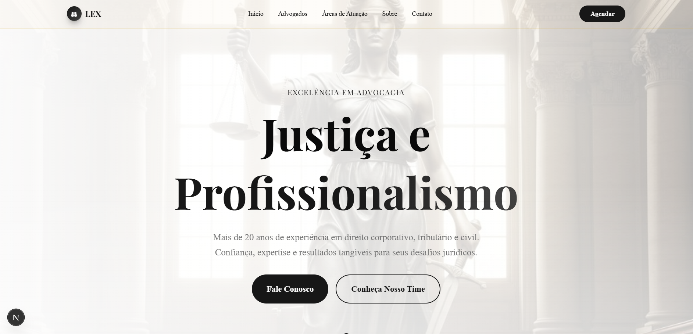
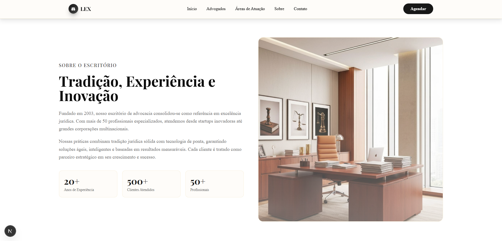

# ⚖️ LEX — Website Institucional de Advocacia

Site institucional moderno e profissional desenvolvido com **React**, **Next.js**, **TypeScript**, **Node.js** e **CSS**, criado para apresentar serviços jurídicos, equipe especializada, áreas de atuação e um canal direto de contato com clientes.

---

## 📸 Prévia do Projeto


### 🖼️ Home — Seção Principal



### 👨‍⚖️ Equipe de Advogados


### 📚 Áreas de Atuação


### 🏛️ Sobre o Escritório



### 📞 Contato


---

## ✨ Funcionalidades do Projeto

### ✔ Página inicial moderna

* Hero Section imponente com foco em tradição e profissionalismo
* Texto institucional com forte apelo jurídico

### ✔ Apresentação da equipe

* Cards individuais com foto, especialidade e descrição
* Layout sofisticado e responsivo

### ✔ Áreas de atuação

* Várias especialidades do direito
* Ícones ilustrativos e textos claros

### ✔ Página “Sobre”

* História do escritório
* Métricas e destaques institucionais
* Foto do ambiente corporativo

### ✔ Página de contato

* Formulário funcional
* Integração com WhatsApp
* Endereço, telefone e e-mail

---

## 🚀 Tecnologias Utilizadas

| Tecnologia     | Finalidade                                  |
| -------------- | ------------------------------------------- |
| **React**      | Construção da interface interativa          |
| **Next.js**    | Renderização otimizada, rotas e performance |
| **TypeScript** | Tipagem segura e manutenção mais fácil      |
| **Node.js**    | Ambiente backend e scripts de build         |
| **CSS**        | Estilo, layout e responsividade             |

---

## 📁 Estrutura do Projeto

```
# File Tree: SiteAdvocacia
```

```
├── app
│   ├── globals.css
│   ├── layout.tsx
│   └── page.tsx
├── components
│   ├── ui
│   │   ├── accordion.tsx
│   │   ├── alert-dialog.tsx
│   │   ├── alert.tsx
│   │   ├── button.tsx
│   │   ├── card.tsx
│   │   ├── carousel.tsx
│   │   ├── input.tsx
│   │   ├── form.tsx
│   │   ├── table.tsx
│   │   └── ...outros
│   ├── about-section.tsx
│   ├── contact-section.tsx
│   ├── footer.tsx
│   ├── hero.tsx
│   ├── highlights.tsx
│   ├── lawyer-card.tsx
│   ├── lawyers-section.tsx
│   ├── navigation.tsx
│   ├── practice-areas.tsx
│   ├── theme-provider.tsx
│   └── testimonials.tsx
├── hooks
│   ├── use-mobile.ts
│   └── use-toast.ts
├── lib
│   └── utils.ts
├── public
│   ├── imagens e assets do projeto
├── styles
│   └── globals.css
├── .gitignore
├── components.json
├── next-env.d.ts
├── next.config.mjs
├── package.json
├── pnpm-lock.yaml
├── postcss.config.mjs
└── tsconfig.json
```

---

## 🧭 Como Executar o Projeto

### 1️⃣ Clone o repositório

```bash
git clone https://github.com/SEU-USUARIO/NOME-DO-REPO.git
```

### 2️⃣ Instale as dependências

```bash
npm install
```

### 3️⃣ Execute em modo desenvolvimento

```bash
npm run dev
```

### 4️⃣ Acesse no navegador

```
http://localhost:3000
```

---

## 🧩 Personalização

Você pode alterar facilmente:

* Paleta de cores e tipografia
* Conteúdo institucional
* Informações e fotos da equipe
* Textos das áreas de atuação
* Integração com APIs externas ou WhatsApp
* Organização das seções do site

---

## 👨‍💻 Autor

Projeto desenvolvido por **Ylgner Witoszynski**, com foco em soluções corporativas, interfaces modernas e desenvolvimento de aplicações profissionais em React + TypeScript.
